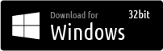

__Civil Services__ is a collection of tools that make it possible for citizens to be a part of what is happening in their Local, State & Federal Governments.

[](https://www.paypal.me/civilservices)


GeoJSON Mapbox Electron App
===

[](https://raw.githubusercontent.com/CivilServiceUSA/civil-services-geojson-app/master/LICENSE)  [](https://github.com/CivilServiceUSA/civil-services-geojson-app/graphs/contributors)

#### Electron App for Loading GeoJSON files with Mapbox

We built this app because we are creating a few thousand GeoJSON files and discovered that there was no easy way to view them on your local computer. Since GeoJSON files are important to our development process, and likely important to yours, we decided to spend the time to make a native app that you can use to open GeoJSON files on your local machine.

[](./dist/macos/)
[](./dist/windows-32bit/)
[](./dist/windows-64bit/)


## [See Full Demo Video](https://vimeo.com/202877564)


App Features
---

This initial release was developed as a weekend project by [@mrmidi](https://twitter.com/mrmidi) so it certainly has room to grow, but currently this app has the following features:

* Supports `.json` & `.geojson` file extensions
* Open GeoJSON Maps via `File > Open` Menu
* Open GeoJSON Maps via Drag & Drop onto App
* Open GeoJSON Maps via Command Line ( as either raw data or file path )
* Built with Multiple Language Support ( just add a JSON file in `./translations` )
* Six different Map Themes: Dark, Light, Outdoors, Satellite, Streets & Hybrid ( Satellite Streets )
* Slide out Drawer to preview GeoJSON Map Properties for Clicked Features
* Automatic Data Conversion of URLs & Images for instant previews
* Automatically reloads the last file you were looking at when you restart the app
* Keeps track of your app preferences ( selected theme, window size & location )


Developer Requirements
---

* [Yarn](https://yarnpkg.com)
* [Node](https://nodejs.org)

Install App
---

Installation is done via Yarn Installation:

```bash
yarn install -g civil-services-geojson-app
```

Launch App
---

You can launch the app using a Terminal Window via:

#### Directly by Name:

```bash
geojson
```

#### Via Yarn Script:

```bash
cd /path/to/this/project
yarn start
```

#### Via Node:
 
 ```bash
 cd /path/to/this/project
 node ./bin/cli.js
 ```

#### Advanced Launch Options

This can be used by either `geojson` or `node ./bin/cli.js` methods:

```bash
geojson /path/to/filename.geojson
cat filename.geojson | geojson
```

Currently there is only one `flag` you can pass, which is used to set the `theme`.  Here are the current theme options:

```bash
geojson /path/to/filename.geojson --theme=dark
geojson /path/to/filename.geojson --theme=light
geojson /path/to/filename.geojson --theme=outdoors
geojson /path/to/filename.geojson --theme=satellite
geojson /path/to/filename.geojson --theme=streets
geojson /path/to/filename.geojson --theme=satellite-streets
```

Build Native App
---

If you are feeling a bit adventurous and want to actually build the app on your machine as a Native App, there are a few commands setup to make that easy.  All Native Apps are package and built into the `./builds` directory.  These files are not included in this project as they would not likley work for everyone.

#### MacOS

If you are on a MacoOS you can simply run:

```bash
yarn run build-macos
```

If you have more than one Developer Profile on your Mac, Yyou will need to set a `CSC_NAME` Environmental Variable to use for building Mac OS apps.

To determine what your `CSC_NAME` value should be, you can open Keychain Access and look for `Developer ID Installer`.  If your certificate name is `Developer ID Installer: Jane Doe (CS3BE56SC5)` the value you want is `Jane Doe (CS3BE56SC5)`

Then you can run

```bash
export CSC_NAME="Jane Doe (CS3BE56SC5)" && yarn run build-macos
```

#### Windows

Build 32 bit Executable:

```bash
yarn run build-windows-32
```

Build 64 bit Executable:

```bash
yarn run build-windows-64
```

#### Linux

```bash
yarn run build-linux
```
